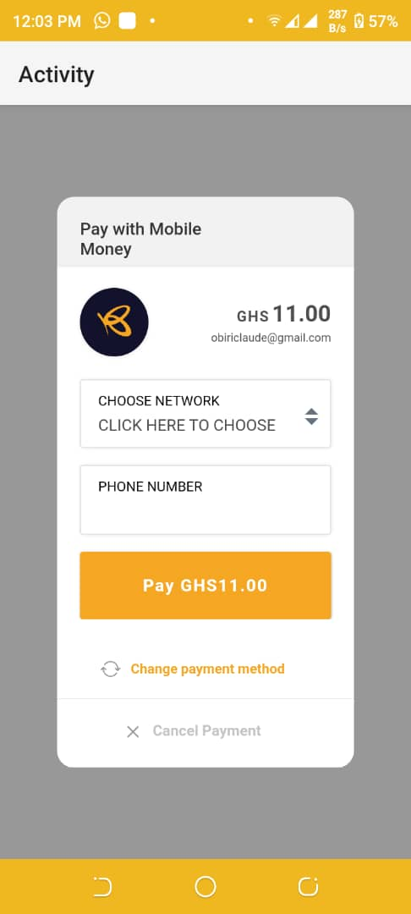
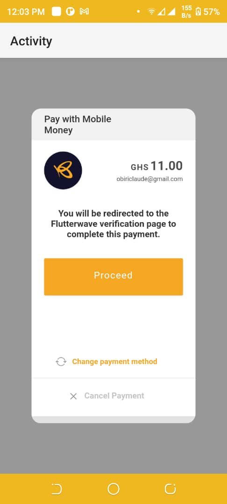
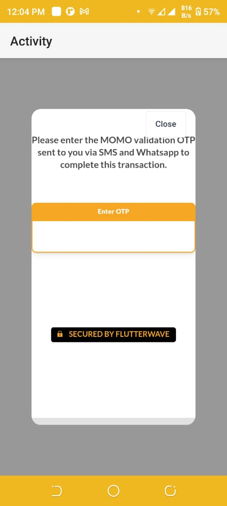
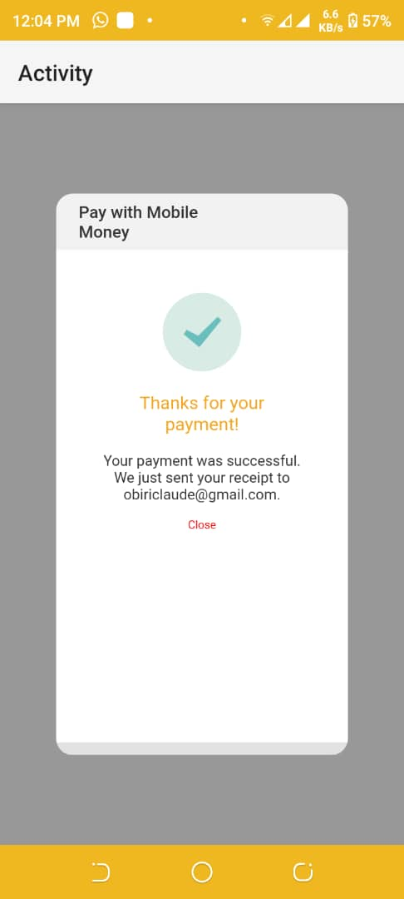
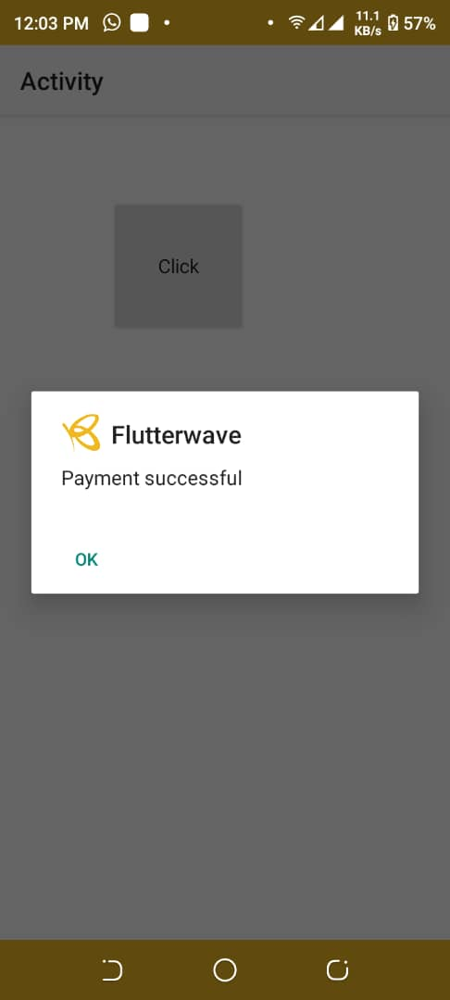

[](https://android-arsenal.com/api?level=16)


## Flutterwave B4A Android Library

This is a library for easy integration of [Flutterwave](https://flutterwave.com) with your Android application with [B4A](https://www.b4x.com/b4a.html).
Use this library in your B4A project.

## Summarized flow

1. Collect user's details such as email & name

2. Initialize the transaction
	- Call the [Initialize Transaction](https://developer.flutterwave.com/docs/collecting-payments) endpoint
    - App will loads [WebView](https://b4x.com/android/help/views.html#webview) to initialize a transaction
    - User enter details for transaction

4. Once successful, a prompt will be displayed.

## Requirements
- Android SDKv16 (Android 4.1 "Jelly Bean") and above

## Installation & Usage

### B4A
#### Download Flutterwave.jar & Flutterwave.xml and place in your additional libraries folder
#### Enable the Flutterwave Library in your Libraries Tab
#### Assign Flutterwave Library to a Variable

```
Sub Globals
	Dim Pay As Flutterwave
End Sub
```
#### Initialize Flutterwave Library
```
Sub Activity_Create(FirstTime As Boolean)
	Activity.LoadLayout("Layout")	
	Pay.Initialize("Pay","FLWPUBK_TEST-SANDBOXDEMOKEY-X",Me,Activity,True)
End Sub
```

#### Perform a transaction
```
Sub Button1_Click
	InitializeTransaction("obirixxxxxx@gmail.com","0558382XXX","Clxxxx Oxxxx", 1,"test-1234567890","Label","TEST",Pay.CURRENCY_GHS,"")
End Sub
```
## Demo
Download/Clone [https://github.com/claudeamadu/flutterwave-b4a/tree/master/Demo](https://github.com/claudeamadu/flutterwave-b4a/tree/master/Demo)
<br/></img> </img> </img>  </img> 

## Security

If you discover any issues, please email obiriclaude@gmail.com.

## Contact

For more enquiries and technical questions regarding the B4A Android FlutterwaveSdk, please post on 
our issue tracker: [https://github.com/claudeamadu/flutterwave-b4a/issues](https://github.com/claudeamadu/flutterwave-b4a/issues).

## Change log

Please see [CHANGELOG](CHANGELOG.md) for more information what has changed recently.

